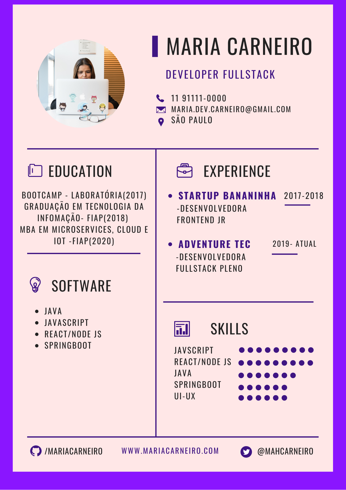
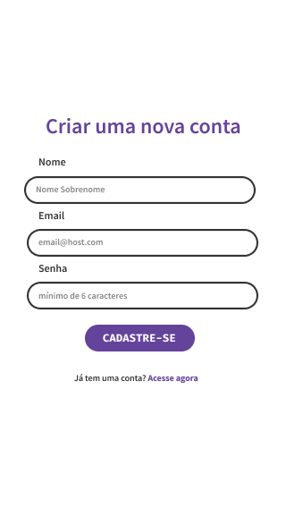
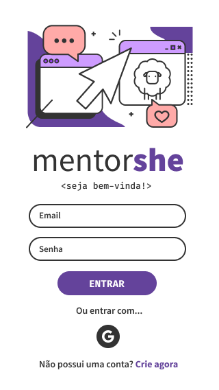
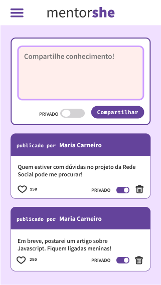
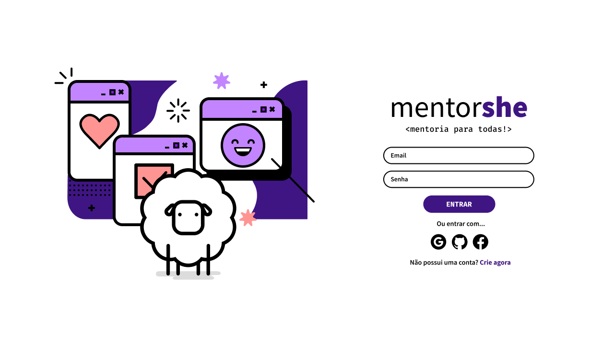
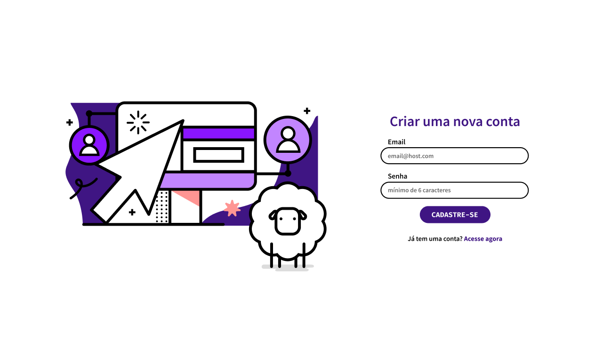

# MentorShe

## Índice

* [1. Produto](#1-produto)
* [2. Protopersona](#2-protopersona)
* [3. História do usuário](#3-historia-do-usuario)
* [4. Prototipação](#4-prototipacao)
* [5. UX](#5-ux)
* [6. UI](#6-ui)
* [7. Tecnologias utilizadas](#7-tecnologias-utilizadas)
* [8. Autores](#8-autores)

***

## 1. Produto

Desenvolvemos uma rede social de mentoria para mulheres. Nela, mentoras e mentoradas podem trocar conhecimentos e experiências sobre programação em geral em um ambiente seguro e acolhedor.

## 2. Protopersona

Para este produto criamos a Maria Carneiro, que nos orientou sobre as necessidades mais básicas dos usuários e seu perfil:

**MARIA CARNEIRO**

**Informações demográficas**

- 26 anos;
- Graduada em tecnologia da informação;
- Desenvolvedora fullstack pleno;
- Mora em São Paulo, Brooklin;
- Trabalha na Faria Lima.

Você pode visualizar o currículo da Maria Carneiro aqui: 

**Comportamento**

- Amante de tecnologia;
- Adora contribuir com a comunidade tech;
- Não perde um meetup das linguagens que seja de seu interesse.
- Gosta de jogar vídeo game;.

**Necessidades**

Precisa de um ambiente seguro onde consiga compartilhar seus conhecimentos e experiências sem ter sua capacidade posta em dúvida por ser mulher. Quer contribuir para que mais mulheres entrem no mercado de tecnologia da informação. 

## 3. História do usuário

Tendo como referência as necessidades da **Maria Carneiro**, elaboramos o seguinte épico para nossas quatro sprints de desenvolvimento:

- Ter uma rede social onde fosse possível logar com e-mail, conta do google ou github. Após logada, poder compartilhar mensagens tanto públicas quanto privadas. Poder editar seus posts, bem como cancelar esta edição e voltar ao conteúdo original. Poder curtir as mensagens postadas por outras mentoras e mentoradas. Poder deletar as mensagens, alterar o seu perfil e fazer update de fotos.

## 4. Prototipação

Para este projeto, tivemos acesso ao layout da tela mobile e desktop em que deveriamos replicar visualmente e cujo conteúdo, cores e fontes de texto ficou ao nosso critério de acordo com o resultado do nosso benchmarking.

Estas foram os layouts propostos:

* Tela mobile

    

* Tela Desktop

    

**Benchmarking**

Análise de melhores práticas no mercado

Com o layout pré definido, passamos para a busca de referências visuais. Pesquisamos diversos sites de tecnologia de iniciativas femininas para encontramos inspirações de cores, fontes e nome da nossa rede social.

Após o contato com diversos sites, fóruns e páginas ligadas a programação, chegamos a conclusão de que um desenho de página minimalista com uma paleta de cores em tons femininos, traria maior destaque ao conteúdo.

## 5. UX

Pensando na praticidade de entrar na rede social, na página de login, optamos por disponibilizar três formas do usuário logar, sendo elas: e-mail, conta google ou conta github. Assim que logado, o usuário já tem acesso ao feed onde consegue visualizar todos os posts e a área onde pode fazer seus próprios posts de forma publica ou privada, e no menu hamburguer ele pode optar por ir até a página de perfil ou por fazer o logout.

Pensando na disposição de botões em telas reduzidas estudamos o uso de ícones para as funções de navegação, edição, curtidas e privacidade somadas a palavras curtas reforçando sua leitura e aumentando assim sua acessibilidade.

Acesse o protótipo de baixa fidelidade clicando nas imagens abaixo:

* Versão Mobile

    

    

    

* Versão Desktop

    

    

    

## 6. UI

Tendo validado nosso protótipo e reunido referências visuais, só nos restava aplicar estes conceitos nas escolhas do design de interface.

Seguindo noções de material e flat design projetamos a interface com alguns aspectos em mente:

CORES: Utilizamos uma paleta de cores que remetesse a feminilidade e a criatividade. As cores que escolhemos de acordo com a psicologia das cores remetem a criatividade, motivção, pureza e fé.
TIPOGRAFIA: Buscando harmonia com as cores e estilos próprios, optamos por usar uma tipografia que remete ao mundo da programação.

## 7. Tecnologias utilizadas

- HTML
- Javascript
- CSS
- NodeJs
- Firebase

## 8. Autores

* Larissa Miyaji

* Kelly Alves

* Tamires Cordeiro

